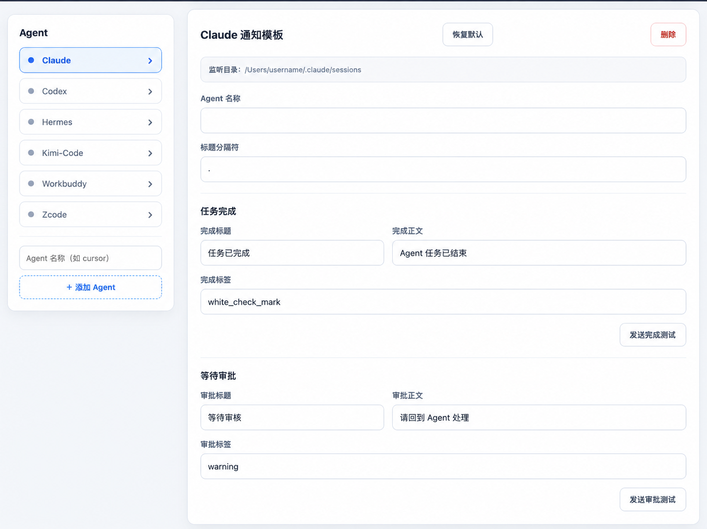

<p align="center">
  
</p>

<h1 align="center">Agents Notify</h1>

<p align="center">把 AI Agent 的任务完成和授权提醒发送到手机与手表。</p>

当 Codex、Claude Code、ZCode、Kimi Code 等 Agent 完成任务或需要你授权时，Agents Notify 会通过 [ntfy](https://ntfy.sh/) 发送固定通知。通知可由手机的运动健康应用同步到手表。

> 通知不包含 Agent 回复、源代码、命令、文件路径或审批原因。

## 开始前

你需要：

- macOS 或 Windows，已安装 Python 3.10+。
- 安卓手机，已安装 ntfy。中国大陆建议使用 F-Droid 版。
- 支持同步手机应用通知的手表。

先在 ntfy 中订阅一个足够长、随机且只有自己知道的主题，再开启 ntfy 的通知权限、后台自启和“无限制”省电策略。最后在运动健康应用中允许同步 ntfy 通知。

## 一键安装

### 桌面程序

从 GitHub Actions 下载对应平台的 `Agents-Notify.exe` 或
`Agents-Notify-macOS-arm64.dmg`。桌面程序会在应用窗口内显示配置页；关闭窗口后
继续在系统托盘或菜单栏运行，可从菜单重新打开配置或彻底退出。

桌面程序与下方 CLI 安装方式共用配置和通知记录。同一台电脑同时运行两者时，
只有一个进程负责监听，避免重复发送通知。

### CLI

#### macOS

```bash
sh -c "$(curl -fsSL https://raw.githubusercontent.com/galaxrin/Agents-Notify/main/scripts/bootstrap.sh)"
```

#### Windows PowerShell

```powershell
& ([scriptblock]::Create((irm https://raw.githubusercontent.com/galaxrin/Agents-Notify/main/scripts/bootstrap.ps1)))
```

安装脚本会自动：

1. 从 GitHub 安装最新版。
2. 注册开机自启的后台服务。
3. 打开 Web 配置页。

不需要 Git，也不需要克隆仓库。

## 配置通知

在 Web 页面填写 ntfy 主题和可选 Token，然后为每个 Agent 设置完成、等待审批的通知文案。配置会自动保存并立即生效。



以后如需重新打开 Web 配置：

```bash
agent-watch-notify --config
```

浏览器会自动打开 `http://127.0.0.1:9876`。终端需保持运行；配置完后按 `Ctrl+C` 关闭 Web 服务。后台通知服务不受影响。

## 发送测试通知

```bash
agent-watch-notify --test
```

手机和手表默认会收到：

```text
任务已完成
Agent 任务已结束
```

## 重启后台服务

Web 配置保存后无需重启。如果修改了安装或运行环境，可手动重启。

### macOS

```bash
launchctl kickstart -k "gui/$(id -u)/com.agent.watch-notify"
```

### Windows PowerShell

```powershell
schtasks /end /tn agent-watch-notify
schtasks /run /tn agent-watch-notify
```

## 常见问题

- **测试通知发送失败**：检查 ntfy 主题、Token 和电脑网络。
- **ntfy 网页收到，但手机延迟**：建议使用 F-Droid 版 ntfy，并开启自启、后台锁定和无限制省电。
- **手机收到，但手表没有**：检查运动健康的应用通知同步和蓝牙连接。
- **测试正常，真实任务不通知**：检查后台服务状态和错误日志。

查看服务状态：

```bash
# macOS
launchctl print "gui/$(id -u)/com.agent.watch-notify"
```

```powershell
# Windows PowerShell
schtasks /query /tn agent-watch-notify /v
```

查看错误日志：

```bash
# macOS
tail -n 100 "$HOME/Library/Logs/agent-watch-notify/stderr.log"
```

```powershell
# Windows PowerShell
Get-Content "$env:USERPROFILE\.local\state\agent-watch-notify\stderr.log" -Tail 100
```

<details>
<summary><strong>高级配置与运行机制</strong></summary>

### 运行机制

Agents Notify 会自动发现 `~/.*/sessions`、`~/.*/cli/agents` 和 `~/.*/cli/rollout` 中的 Agent 会话日志，只读取新增的完整行。

- 任务完成：立即发送完成通知。
- 需要授权：等待默认 10 秒；期间自动处理则不通知。
- 最近 500 个已通知事件保存在 `~/.local/state/agent-watch-notify/seen.json` 中用于去重。
- 网络请求超时为 5 秒，目前不提供离线补发。

### 环境变量

| 变量 | 默认值 | 说明 |
|---|---:|---|
| `AGENT_WATCH_NTFY_URL` | — | ntfy 主题或 HTTP(S) 地址 |
| `AGENT_WATCH_NTFY_TOKEN` | — | ntfy 认证 Token，可选 |
| `AGENT_WATCH_SESSIONS_DIR` | 自动发现 | 逗号分隔的会话目录 |
| `AGENT_WATCH_APPROVAL_DELAY` | `10` | 授权通知宽限期，单位秒 |
| `AGENT_WATCH_POLL_INTERVAL` | `1` | 轮询间隔，最小 0.5 秒 |

旧版 `CODEX_WATCH_*` 变量仍然兼容，新变量优先。

### 手动安装

```bash
git clone https://github.com/galaxrin/Agents-Notify.git
cd Agents-Notify
pip install .
agent-watch-notify --install
```

### 开发验证

项目仅使用 Python 标准库：

```bash
python3 -m unittest discover -s tests -v
python3 -m compileall -q agent_watch_notify tests
```

</details>

## 安全说明

- Web 配置页只监听 `127.0.0.1`，不暴露到局域网。
- ntfy 主题相当于密码，请使用随机长主题，不要提交或公开分享。
- 主题和 Token 保存在本机权限为 `600` 的配置与服务文件中。

## 卸载

```bash
agent-watch-notify --uninstall
pip uninstall agent-watch-notify
```

如需同时清除去重历史：

```bash
rm -f "$HOME/.local/state/agent-watch-notify/seen.json"
```

## 从旧版迁移

如果你安装过 `codex-watch-notify`，请先卸载旧版，再运行新版一键安装命令。

## License

[MIT](LICENSE)
